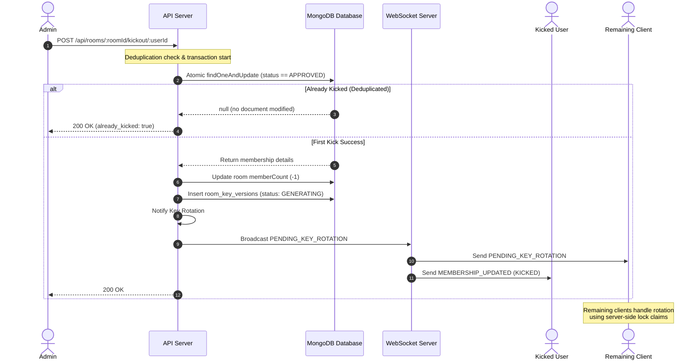

# Room Kickout, Leave, and Admin Management Architecture

This document specifies the technical architecture for the Room Kickout, Leave, and Admin Management features in DeChat, keeping the privacy-first End-to-End Encryption (E2EE) key-rotation system and edge cases fully integrated.

---

## 1. Objectives

1. **Secure Member Kickout**: Allow only room admins (`ADMIN` or `OWNER` role) to kick members.
2. **Graceful Member Leave**: Allow approved members to leave the room voluntarily.
3. **Safe Admin Succession**: Ensure that a room is never left without an administrator. Provide mechanisms for leaving admins to nominate new admins or elevate all members to admins.
4. **Resilient Key Rotation Integration**: Ensure that when a member is kicked or leaves, the shared AES room key is rotated so the departed user cannot read future messages.
5. **Robust Re-Joining Lifecycle**: Allow kicked/departed users to request to join again (following the standard approval flow) while retaining their history (such as `kickoutCount`) to prevent abuse.
6. **Thread-Safe Request Deduplication**: Prevent race conditions when multiple admins attempt to kick the same user simultaneously.

---

## 2. Role Hierarchy & Permissions

The application recognizes three roles for active memberships:

| Role | Permissions | Description |
|---|---|---|
| `OWNER` | Full control, Admin management, Disable room, Kick members, Approve requests | Creator of the room. Cannot leave without transferring ownership or deleting the room. |
| `ADMIN` | Kick members, Promote members, Approve requests, Leave room (with succession rules) | Promoted by an Owner or another Admin. |
| `MEMBER` | Read/write messages, Leave room | Standard participant. |

---

## 3. Detailed Component Architecture



### 3.1 Kickout Flow & Deduplication

To prevent race conditions where two admins click "Kick" on User C at the same instant (which would otherwise trigger multiple key rotations, double-decrement the `memberCount`, and corrupt status logs), the server handles the kickout request using an atomic CAS (Compare-And-Swap) command in MongoDB.

#### The Deduplication Algorithm
1. The server receives `POST /api/rooms/:roomId/kickout/:userId`.
2. The server verifies that the requesting user is an admin (`OWNER` or `ADMIN`).
3. The server runs an atomic `findOneAndUpdate` on `room_memberships`:
   ```typescript
   const result = await db.collection("room_memberships").findOneAndUpdate(
     {
       roomId: new ObjectId(roomId),
       userId: new ObjectId(targetUserId),
       status: "APPROVED" // Only target active approved members
     },
     {
       $set: {
         status: "LEFT",
         leftAt: now,
         updatedAt: now
       },
       $inc: { kickoutCount: 1 } // Increment total times kicked
     }
   );
   ```
4. **Evaluation**:
   - **If no document is returned (null)**: The target user is either not approved, already kicked, or has already left. The server immediately returns a `200 OK` response with `{ ok: true, alreadyProcessed: true }` and does **not** perform any further actions.
   - **If a document is returned**: This is the first and only request that succeeds in kicking the user. The server continues execution:
     - Decrements `memberCount` in the `rooms` collection.
     - Checks if other approved members exist.
     - If so, updates the room's `pendingKeyRotation` to `true` and inserts a `room_key_versions` record with state `GENERATING` to trigger the E2EE key-rotation process.
     - Emits a WebSocket notification `MEMBERSHIP_UPDATED` to the kicked user (causing their client to exit the room and clear the active room key cache).
     - Emits `PENDING_KEY_ROTATION` to the remaining room members.

---

### 3.2 Leave Flow & Admin Succession

When a standard member leaves, they simply update their membership to `LEFT` and trigger a key rotation. However, when an administrator (`ADMIN` role) leaves, they must not leave the room leaderless if they are the sole administrator.

#### Succession Logic:
1. The server receives `POST /api/rooms/:roomId/leave` with optional body:
   ```json
   {
     "promoteToAdmin": ["userId1", "userId2"],
     "makeEveryoneAdmin": false
   }
   ```
2. The server queries the memberships of the room to determine:
   - Is the leaving user an admin (`ADMIN` or `OWNER` role)?
   - How many active admins (`ADMIN` or `OWNER`) are currently in the room?
3. **Admin Succession Guard**:
   - If the leaving user is **not the last admin**, or if there is a separate room `OWNER`, they can leave immediately.
   - If the leaving user is the **only admin/owner remaining** in the room:
     - **Case A: There are other approved members in the room**:
       - If `makeEveryoneAdmin === true`: The server promotes all other active approved members in the room to the `ADMIN` role.
       - Else if `promoteToAdmin` contains a list of valid active member IDs: The server promotes those specified members to `ADMIN`.
       - Else: The server rejects the leave request with a `400 Bad Request` and returns a list of active members to let the admin select a successor.
     - **Case B: No other members remain in the room (Last User Leaves)**:
       - The admin/owner can leave directly, reducing the room's `memberCount` to `0`.
       - The room's status is updated to `isDisabled = true`, disabling all messaging inside the room.
       - **Privilege Retention**: The leaving user's role (`OWNER` or `ADMIN`) is **held (preserved)** on their `room_memberships` record rather than being reset to `MEMBER`. This is critical because under the standard join flow, their join request would go into a `PENDING` state and remain unapproved forever since no one is left in the room to approve it. Preserving their role allows them to directly rejoin and reactivate the room.
4. After resolving succession, the server:
    - Updates the leaving user's membership status to `LEFT`.
    - If other members remain in the room, the leaving user's role is reset to `MEMBER` (to prevent privilege escalation if they rejoin). If no other members remain (the last user left), their role (`OWNER` or `ADMIN`) is **held/preserved** as-is.
    - Decrements `memberCount`.
    - Triggers key rotation for remaining members (if any).

---

### 3.3 Re-Joining Flow & Membership Retention

To prevent kicked users from bypassing the `MAX_KICKOUTS` restriction by clearing their membership state, membership records are **never deleted** on kickout or leave. Instead, they are updated and transitioned.

```
                  ┌───────────────┐
                  │   PENDING     │
                  └───────┬───────┘
                          │ (Approve)
                          ▼
                  ┌───────────────┐
         ┌───────►│   APPROVED    ├───────┐
         │        └───────┬───────┘       │
         │                │               │
         │ (Re-join)      │ (Leave)       │ (Kickout)
         │                ▼               ▼
         │        ┌───────────────┐       │
         └────────┤     LEFT      │◄──────┘
                  └───────────────┘
```

#### Re-joining Algorithm:
1. When a user requests to join a room (`POST /api/rooms/:roomId/join`):
2. The server checks for an existing membership:
   - If `status === "APPROVED"`: Reject (already in room).
   - If `status === "PENDING"`: Reject (request already pending).
   - If `isBlocked === true`: Reject (user is banned).
3. The server checks the member's kickout history:
   - Reads `kickoutCount` from the existing membership record.
   - If `kickoutCount >= MAX_KICKOUTS` (default: 3): Reject with a `403 Forbidden` explaining that the user has been banned due to repeated removals.
4. **Direct Rejoin & Room Reactivation**:
   - If the existing membership has status `LEFT` and the role is **held/preserved** as `OWNER` or `ADMIN`, AND the room is currently disabled (`isDisabled === true`) and empty:
     - The server directly updates the membership status to `APPROVED` (bypassing standard join approvals).
     - The server updates the room: sets `isDisabled = false` (reactivating the room) and sets `memberCount = 1`.
     - Returns the updated membership and room state.
5. **Standard State Transition (Fallback)**:
   - If the user does not qualify for direct rejoin, the server **updates** the record instead of creating a new one:
     ```typescript
     await db.collection("room_memberships").updateOne(
       { _id: existing._id },
       {
         $set: {
           status: "PENDING",
           role: "MEMBER", // Reset role to base MEMBER
           updatedAt: now,
           reviewedBy: null,
           reviewedAt: null
         }
       }
     );
     ```
   - This keeps the historical `kickoutCount` intact and forces standard users through the standard admin approval flow.


---

## 4. E2EE Key Rotation Lifecycle & Client Synchronization

When a member leaves or is kicked, the room enters a `pendingKeyRotation` state. Because the server does not hold private cryptographic keys and cannot generate room keys, the rotation is executed by the first online room member.

### 4.1 Key Rotation Step-by-Step

1. **Trigger**: Server sets `rooms.pendingKeyRotation = true` and inserts a `room_key_versions` document with status `"GENERATING"`.
2. **Broadcast**: Server sends `PENDING_KEY_ROTATION` via WebSockets to all clients in the room.
3. **Buffer Outgoing Messages (Outbox Integration)**:
   - Remaining clients transition their local UI state to rotating.
   - Any message typed and sent during this state is placed into the **durable outbox** (IndexedDB `outbox-db` store) with a status of `PENDING` and flag `isRotationQueued: true` (which retains the unencrypted plaintext and the old key details). This ensures messages survive page reloads or tab closures.
   - The UI optimistically displays these messages with a `Sending...` status (no cryptographic errors or security alerts shown).
4. **Lock Claim (CAS)**:
   - Remaining clients call `POST /api/rooms/:roomId/key-rotation/claim`.
   - The server uses `findOneAndUpdate` with a 30-second TTL to award the lock to exactly one client (the **Leader**).
5. **Key Generation (Leader)**:
   - The Leader generates a new cryptographically secure AES-256-GCM key in the browser.
   - The Leader fetches the RSA public keys of all **currently approved** members (excluding the kicked/departed user).
   - The Leader encrypts (wraps) the new AES key for each member.
6. **Publishing (Leader)**:
   - The Leader sends the wrapped keys to `POST /api/rooms/:roomId/key-rotation/complete`.
   - The server inserts the wrapped keys into `room_key_distribution`, updates `rooms.lastKeyVersion`, sets `rooms.pendingKeyRotation = false`, and sets `room_key_versions.status = "COMPLETE"`.
   - Server broadcasts `KEY_ROTATION_COMPLETE` to all clients.
7. **Synchronization (Followers)**:
   - Followers receive `KEY_ROTATION_COMPLETE`.
   - They fetch their specific new wrapped key via `GET /api/rooms/:roomId/my-key-distribution`, decrypt it using their private key, and cache it in IndexedDB.
8. **Outbox Flush**:
   - Both the Leader and Followers trigger their background outbox workers.
   - The worker loads all outbox messages with `isRotationQueued: true` for the room.
   - The worker re-encrypts the saved message plaintext using the newly received key version, updates the outbox record, and transmits it via WebSockets.


---

## 5. API Endpoint Specifications

### 5.1 POST `/api/rooms/:roomId/kickout/:userId`
Removes a member from a room. Admin only.

* **Security**: Enforces `isRoomAdmin(roomId, currentUserId)`.
* **Payload**: None.
* **Responses**:
  * `200 OK`: `{ "ok": true }` or `{ "ok": true, "alreadyProcessed": true }` (deduplicated)
  * `403 Forbidden`: Admin credentials required / Cannot kick owner
  * `404 Not Found`: Room or member not found

### 5.2 POST `/api/rooms/:roomId/leave`
Voluntarily leaves a room.

* **Payload**:
  ```json
  {
    "promoteToAdmin": ["userId1", "userId2"],
    "makeEveryoneAdmin": boolean
  }
  ```
* **Responses**:
  * `200 OK`: `{ "ok": true }`
  * `400 Bad Request`: Needs succession nomination (when leaving user is the sole admin)

### 5.3 POST `/api/rooms/:roomId/admins`
Promotes users to `ADMIN` status. Admin only.

* **Payload**:
  ```json
  {
    "userIds": ["userId1", "userId2"],
    "makeEveryoneAdmin": boolean
  }
  ```
* **Responses**:
  * `200 OK`: `{ "ok": true }`
  * `403 Forbidden`: Admin credentials required

### 5.4 POST `/api/rooms/:roomId/join` (Updated)
Sends a request to join a room.

* **Responses**:
  * `201 Created`: Join request sent successfully
  * `403 Forbidden`: Max kickout limit reached or user is blocked
  * `409 Conflict`: Room is full / Already a member

---

## 6. Edge Cases & Resilience

| Edge Case | Failure Mode | Mitigation Strategy |
|---|---|---|
| **Multiple Admins Simultaneous Kick** | Duplicate key rotation records, race conditions. | Handled via atomic `findOneAndUpdate` matching `status: "APPROVED"`. Losers are deduplicated and receive `200 OK` instantly with no DB side effects. |
| **Last Admin/Owner Leaves (Multiple Members)** | Room left without an admin, lock-out of admin panels. | Enforce succession checks: Reject leave if no other admin exists, prompting the admin to nominate successors or click "Make Everyone Admin". |
| **Last Admin/Owner Leaves (Last User in Room)** | Room is left empty and locked forever because re-joining requires admin approval. | The room is marked as `isDisabled: true` (no messages allowed). The user's role (`OWNER`/`ADMIN`) is **held/preserved** as-is. They can rejoin directly to reactivate the room (`isDisabled: false`). |
| **All Members Offline During Rotation** | Key rotation is blocked because no client can generate keys. | The room remains in `pendingKeyRotation = true` state. The first member who reconnects and enters the room immediately claims the lock, generates the key, and completes the rotation. |
| **Client Disconnects Mid-Generation** | Lock is orphaned, rotation stuck. | The lock has a 30-second TTL (`lockExpiry`). After 30 seconds, another online client (or the same client on reconnect) can claim the expired lock and generate a new key. |
| **Stale Messages in Local Queue** | Network issues delay key rotation, causing messages to stay in queue indefinitely. | Outbox messages are stored durably in IndexedDB (`isRotationQueued: true`). If they remain unsent for more than 5 minutes due to rotation blocking, the outbox worker transitions them to `FAILED` status, displaying a red cross next to them. |
| **Bypassing Kick Limit via Re-join** | Kicked users rejoin to reset kickout counter. | Membership records are updated to `LEFT`/`PENDING` instead of being deleted. `kickoutCount` is permanently stored and verified on every join request. |

---

## 7. UI Enhancements & Refactored Leave/Succession Plan

This section describes the detailed design and implementation details for the requested UI and behavior changes. No source code modifications will be executed until these designs are approved by the user.

### 7.1 [COMPLETED] Room Details Viewport Options Page & Three-Bars Header Menu

1. **Room Header Customization**:
   - Remove the direct "Invite", "Members Panel", and "Disable" buttons from the header `RoomHeader` component.
   - Insert a "Three Bars" (hamburger/menu) icon button at the far right of the header.
   - When the Options Page is active, the hamburger icon changes to a "Close" (X) icon to allow returning to the chat view.

2. **Viewport Options Layout**:
   - Introduce a local state `showOptions: boolean` in the room page component.
   - When `showOptions` is `true`, replace the main scrollable `MessageList` and `ChatInput` area with the options screen. The header remains visible at the top.
   - The options page will feature a tab layout (or toggle bar):
     - **Options Tab**:
       - Lists room metadata (Name, Description, Tags).
       - **Copy Room Invite Link**: A button displaying the link and copy indicator. Located just above the "Disable Room" option.
       - **Disable/Restore Room Option**: Available to the room Owner. Shows a button with border/status indicator to disable or restore.
       - **Leave Room Button**: A prominent, full-width red button placed at the very bottom. Pressing it triggers a confirmation modal.
     - **Members Tab**:
       - Displays the full list of members in the room.
       - Includes a debounced search input (300ms delay) at the very top.
       - Sorts members by status and role:
         `Owner (online) > Admin (online) > Members (online) > Owner (offline) > Admin (offline) > Members (offline)`.

### 7.2 [COMPLETED] Admin & Owner Actions on Members

1. **Tapping on Members**:
   - When an `OWNER` or `ADMIN` taps/clicks on any member card in the members list:
     - Open a modal/dialog listing admin management options.
     - **Owner options**:
       - Promote to Admin (if member is `MEMBER`).
       - Demote to Member (if member is `ADMIN`).
       - Promote to Owner / Transfer Ownership (sets target to `OWNER` and sets current owner to `ADMIN` or `MEMBER`).
       - Kickout.
     - **Admin options**:
       - Promote to Admin (if member is `MEMBER`).
       - Kickout (if target is standard `MEMBER` or another `ADMIN`, but not the `OWNER`).
     - Standard `MEMBER` users tapping other users will see no actions (or just user details).

2. **New Role Management API Route**:
   - Create a Next.js route: `PATCH /api/rooms/[roomId]/members/[userId]/role/route.ts`.
   - The API will:
     - Validate that the requesting user is an authorized admin/owner.
     - Enforce business logic (e.g., only `OWNER` can transfer ownership; admins cannot promote others to owner or demote the owner).
     - Atomically update the target user's role in the database.
     - If ownership is transferred, demote the old owner to `ADMIN` or `MEMBER` atomically.

### 7.3 [COMPLETED] Admin/Owner Leave Succession Logic

1. **Detection of Single Administrator**:
   - If the leaving user's role is `OWNER` or `ADMIN`, and there are no other active `OWNER` or `ADMIN` members in the room, the leaving user is classified as the "single administrator".
   - If there are other approved members in the room, they cannot leave without nominating successors.

2. **Transfer Responsibilities UI**:
   - If a single administrator clicks "Leave Room" (and there are other approved members), block direct exit and display a "Transfer Responsibilities" Dialog.
   - Provide a debounced search bar to filter members list.
   - **Form Fields**:
     - **If Owner is leaving**: Include a radio selection for "New Owner" (exactly one must be selected) and checkbox options for "Promote to Admin" (multiple can be selected).
     - **If Admin is leaving**: Include checkboxes for "Promote to Admin" (at least one must be selected).
   - A "Promote and Leave" red button triggers the leave request.

3. **Backend succession API extension (`POST /api/rooms/[roomId]/leave`)**:
   - Extend the schema to accept:
     ```json
     {
       "promoteToOwner": "userIdString",
       "promoteToAdmin": ["userId1", "userId2"],
       "makeEveryoneAdmin": boolean
     }
     ```
   - In the database transaction/update:
     - If the leaving user is the `OWNER`, update the target `promoteToOwner` to `OWNER`.
     - If the leaving user is the sole `ADMIN`, update the target `promoteToAdmin` users to `ADMIN`.
     - After promotions, update the leaving user's status to `LEFT` and role to `MEMBER`.
     - Decrement memberCount and trigger E2EE key rotation for remaining members.

### 7.4 [COMPLETED] WhatsApp-like Composer (ChatInput Refactor)

1. **Auto-Growing Multiline Textarea**:
   - Modify `chat-input.tsx` to dynamically calculate the text content height as the user types.
   - On change of the draft value, use a React effect/ref to measure `scrollHeight` of the `<textarea>` after resetting its height to `auto`.
   - Set the textarea height to the measured `scrollHeight`, up to a maximum height of `130px` (approx 5-6 lines). Once this limit is hit, apply `overflow-y-auto` to the textarea, letting it scroll internally.
   - Disable manual dragging/resizing with CSS style `resize: none`.

2. **Fixed Layout & Message Stability**:
   - The send, attachment, and cancel/save edit buttons are styled with static height/width using flex layouts with `items-end` or absolute positioning to remain strictly pinned to the bottom of the composer box. They will not resize or stretch as the textarea grows.
   - Ensure the outer composer container grows naturally upward.
   - Keep chat messages behind the composer stable: no layout jumps or unexpected scrolling.

3. **Auto-Clearing Drafts**:
   - Update `handleSaveEdit` and `onCancelEdit` in the room page to explicitly invoke `setDraft("")` and `setEditingDraft("")` to clear all draft state whenever a message edit draft is either accepted (saved) or rejected (cancelled).

### 7.5 [COMPLETED] Mobile Scroll & Viewport Locking

1. **No Page-Level Scrolling on Mobile**:
   - Ensure the outer room wrapper `div` has `h-[100dvh] flex flex-col overflow-hidden` to avoid browser page scroll.
   - Fix `AppShell` `<main>` padding: set `pb-0` (instead of `pb-20` on mobile) if `isRoomPage` is active, avoiding empty offsets at the bottom.
   - Secure the input box layout at the bottom of the viewport using flexbox positioning, ensuring that only the `MessageList` scroll container scrolls.


