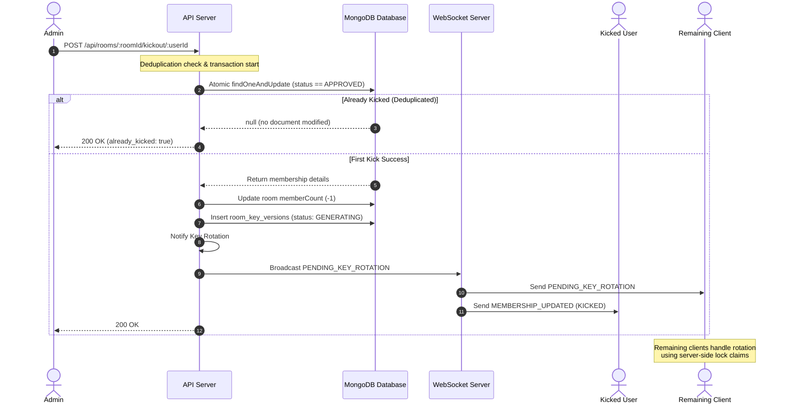

# Room Kickout, Leave, and Admin Management Architecture

This document specifies the technical architecture for the Room Kickout, Leave, and Admin Management features in DeChat, keeping the privacy-first End-to-End Encryption (E2EE) key-rotation system and edge cases fully integrated.

---

## 1. Objectives

1. **Secure Member Kickout**: Allow only room admins (`ADMIN` or `OWNER` role) to kick members.
2. **Graceful Member Leave**: Allow approved members to leave the room voluntarily.
3. **Safe Admin Succession**: Ensure that a room is never left without an administrator. Provide mechanisms for leaving admins to nominate new admins or elevate all members to admins.
4. **Resilient Key Rotation Integration**: Ensure that when a member is kicked or leaves, the shared AES room key is rotated so the departed user cannot read future messages.
5. **Robust Re-Joining Lifecycle**: Allow kicked/departed users to request to join again (following the standard approval flow) while retaining their history (such as `kickoutCount`) to prevent abuse.
6. **Thread-Safe Request Deduplication**: Prevent race conditions when multiple admins attempt to kick the same user simultaneously.

---

## 2. Role Hierarchy & Permissions

The application recognizes three roles for active memberships:

| Role | Permissions | Description |
|---|---|---|
| `OWNER` | Full control, Admin management, Disable room, Kick members, Approve requests | Creator of the room. Cannot leave without transferring ownership or deleting the room. |
| `ADMIN` | Kick members, Promote members, Approve requests, Leave room (with succession rules) | Promoted by an Owner or another Admin. |
| `MEMBER` | Read/write messages, Leave room | Standard participant. |

---

## 3. Detailed Component Architecture



### 3.1 Kickout Flow & Deduplication

To prevent race conditions where two admins click "Kick" on User C at the same instant (which would otherwise trigger multiple key rotations, double-decrement the `memberCount`, and corrupt status logs), the server handles the kickout request using an atomic CAS (Compare-And-Swap) command in MongoDB.

#### The Deduplication Algorithm
1. The server receives `POST /api/rooms/:roomId/kickout/:userId`.
2. The server verifies that the requesting user is an admin (`OWNER` or `ADMIN`).
3. The server runs an atomic `findOneAndUpdate` on `room_memberships`:
   ```typescript
   const result = await db.collection("room_memberships").findOneAndUpdate(
     {
       roomId: new ObjectId(roomId),
       userId: new ObjectId(targetUserId),
       status: "APPROVED" // Only target active approved members
     },
     {
       $set: {
         status: "LEFT",
         leftAt: now,
         updatedAt: now
       },
       $inc: { kickoutCount: 1 } // Increment total times kicked
     }
   );
   ```
4. **Evaluation**:
   - **If no document is returned (null)**: The target user is either not approved, already kicked, or has already left. The server immediately returns a `200 OK` response with `{ ok: true, alreadyProcessed: true }` and does **not** perform any further actions.
   - **If a document is returned**: This is the first and only request that succeeds in kicking the user. The server continues execution:
     - Decrements `memberCount` in the `rooms` collection.
     - Checks if other approved members exist.
     - If so, updates the room's `pendingKeyRotation` to `true` and inserts a `room_key_versions` record with state `GENERATING` to trigger the E2EE key-rotation process.
     - Emits a WebSocket notification `MEMBERSHIP_UPDATED` to the kicked user (causing their client to exit the room and clear the active room key cache).
     - Emits `PENDING_KEY_ROTATION` to the remaining room members.

---

### 3.2 Leave Flow & Admin Succession

When a standard member leaves, they simply update their membership to `LEFT` and trigger a key rotation. However, when an administrator (`ADMIN` role) leaves, they must not leave the room leaderless if they are the sole administrator.

#### Succession Logic:
1. The server receives `POST /api/rooms/:roomId/leave` with optional body:
   ```json
   {
     "promoteToAdmin": ["userId1", "userId2"],
     "makeEveryoneAdmin": false
   }
   ```
2. The server queries the memberships of the room to determine:
   - Is the leaving user an admin (`ADMIN` or `OWNER` role)?
   - How many active admins (`ADMIN` or `OWNER`) are currently in the room?
3. **Admin Succession Guard**:
   - If the leaving user is **not the last admin**, or if there is a separate room `OWNER`, they can leave immediately.
   - If the leaving user is the **only admin/owner remaining** in the room:
     - **Case A: There are other approved members in the room**:
       - If `makeEveryoneAdmin === true`: The server promotes all other active approved members in the room to the `ADMIN` role.
       - Else if `promoteToAdmin` contains a list of valid active member IDs: The server promotes those specified members to `ADMIN`.
       - Else: The server rejects the leave request with a `400 Bad Request` and returns a list of active members to let the admin select a successor.
     - **Case B: No other members remain in the room**:
       - The admin can leave directly, reducing the room's `memberCount` to `0`.
4. After resolving succession, the server:
   - Updates the leaving admin's membership status to `LEFT` and resets their role to `MEMBER` (to prevent privilege escalation if they rejoin).
   - Decrements `memberCount`.
   - Triggers key rotation for remaining members (if any).

---

### 3.3 Re-Joining Flow & Membership Retention

To prevent kicked users from bypassing the `MAX_KICKOUTS` restriction by clearing their membership state, membership records are **never deleted** on kickout or leave. Instead, they are updated and transitioned.

```
                  ┌───────────────┐
                  │   PENDING     │
                  └───────┬───────┘
                          │ (Approve)
                          ▼
                  ┌───────────────┐
         ┌───────►│   APPROVED    ├───────┐
         │        └───────┬───────┘       │
         │                │               │
         │ (Re-join)      │ (Leave)       │ (Kickout)
         │                ▼               ▼
         │        ┌───────────────┐       │
         └────────┤     LEFT      │◄──────┘
                  └───────────────┘
```

#### Re-joining Algorithm:
1. When a user requests to join a room (`POST /api/rooms/:roomId/join`):
2. The server checks for an existing membership:
   - If `status === "APPROVED"`: Reject (already in room).
   - If `status === "PENDING"`: Reject (request already pending).
   - If `isBlocked === true`: Reject (user is banned).
3. The server checks the member's kickout history:
   - Reads `kickoutCount` from the existing membership record.
   - If `kickoutCount >= MAX_KICKOUTS` (default: 3): Reject with a `403 Forbidden` explaining that the user has been banned due to repeated removals.
4. **State Transition**:
   - If the membership record exists and has a status of `LEFT` or `REJECTED`, the server **updates** the record instead of creating a new one:
     ```typescript
     await db.collection("room_memberships").updateOne(
       { _id: existing._id },
       {
         $set: {
           status: "PENDING",
           role: "MEMBER", // Reset role to base MEMBER
           updatedAt: now,
           reviewedBy: null,
           reviewedAt: null
         }
       }
     );
     ```
   - This keeps the historical `kickoutCount` intact and forces the user through the standard admin approval flow.

---

## 4. E2EE Key Rotation Lifecycle & Client Synchronization

When a member leaves or is kicked, the room enters a `pendingKeyRotation` state. Because the server does not hold private cryptographic keys and cannot generate room keys, the rotation is executed by the first online room member.

### 4.1 Key Rotation Step-by-Step

1. **Trigger**: Server sets `rooms.pendingKeyRotation = true` and inserts a `room_key_versions` document with status `"GENERATING"`.
2. **Broadcast**: Server sends `PENDING_KEY_ROTATION` via WebSockets to all clients in the room.
3. **Buffer Outgoing Messages**:
   - Remaining clients transition their local UI state to rotating.
   - Any message typed and sent during this state is placed into an in-memory queue (`messageQueueMap`) on the client and displays a `Sending...` status (no cryptographic errors shown).
4. **Lock Claim (CAS)**:
   - Remaining clients call `POST /api/rooms/:roomId/key-rotation/claim`.
   - The server uses `findOneAndUpdate` with a 30-second TTL to award the lock to exactly one client (the **Leader**).
5. **Key Generation (Leader)**:
   - The Leader generates a new cryptographically secure AES-256-GCM key in the browser.
   - The Leader fetches the RSA public keys of all **currently approved** members (excluding the kicked/departed user).
   - The Leader encrypts (wraps) the new AES key for each member.
6. **Publishing (Leader)**:
   - The Leader sends the wrapped keys to `POST /api/rooms/:roomId/key-rotation/complete`.
   - The server inserts the wrapped keys into `room_key_distribution`, updates `rooms.lastKeyVersion`, sets `rooms.pendingKeyRotation = false`, and sets `room_key_versions.status = "COMPLETE"`.
   - Server broadcasts `KEY_ROTATION_COMPLETE` to all clients.
7. **Synchronization (Followers)**:
   - Followers receive `KEY_ROTATION_COMPLETE`.
   - They fetch their specific new wrapped key via `GET /api/rooms/:roomId/my-key-distribution`, decrypt it using their private key, and cache it in IndexedDB.
8. **Queue Flush**:
   - Both the Leader and Followers encrypt their buffered in-memory messages using the new key version and emit them via `send_message`.

---

## 5. API Endpoint Specifications

### 5.1 POST `/api/rooms/:roomId/kickout/:userId`
Removes a member from a room. Admin only.

* **Security**: Enforces `isRoomAdmin(roomId, currentUserId)`.
* **Payload**: None.
* **Responses**:
  * `200 OK`: `{ "ok": true }` or `{ "ok": true, "alreadyProcessed": true }` (deduplicated)
  * `403 Forbidden`: Admin credentials required / Cannot kick owner
  * `404 Not Found`: Room or member not found

### 5.2 POST `/api/rooms/:roomId/leave`
Voluntarily leaves a room.

* **Payload**:
  ```json
  {
    "promoteToAdmin": ["userId1", "userId2"],
    "makeEveryoneAdmin": boolean
  }
  ```
* **Responses**:
  * `200 OK`: `{ "ok": true }`
  * `400 Bad Request`: Needs succession nomination (when leaving user is the sole admin)

### 5.3 POST `/api/rooms/:roomId/admins`
Promotes users to `ADMIN` status. Admin only.

* **Payload**:
  ```json
  {
    "userIds": ["userId1", "userId2"],
    "makeEveryoneAdmin": boolean
  }
  ```
* **Responses**:
  * `200 OK`: `{ "ok": true }`
  * `403 Forbidden`: Admin credentials required

### 5.4 POST `/api/rooms/:roomId/join` (Updated)
Sends a request to join a room.

* **Responses**:
  * `201 Created`: Join request sent successfully
  * `403 Forbidden`: Max kickout limit reached or user is blocked
  * `409 Conflict`: Room is full / Already a member

---

## 6. Edge Cases & Resilience

| Edge Case | Failure Mode | Mitigation Strategy |
|---|---|---|
| **Multiple Admins Simultaneous Kick** | Duplicate key rotation records, race conditions. | Handled via atomic `findOneAndUpdate` matching `status: "APPROVED"`. Losers are deduplicated and receive `200 OK` instantly with no DB side effects. |
| **Last Admin Leaves** | Room left without an admin, lock-out of admin panels. | Enforce succession checks: Reject leave if no other admin exists, prompting the admin to nominate successors or click "Make Everyone Admin". |
| **All Members Offline During Rotation** | Key rotation is blocked because no client can generate keys. | The room remains in `pendingKeyRotation = true` state. The first member who reconnects and enters the room immediately claims the lock, generates the key, and completes the rotation. |
| **Client Disconnects Mid-Generation** | Lock is orphaned, rotation stuck. | The lock has a 30-second TTL (`lockExpiry`). After 30 seconds, another online client (or the same client on reconnect) can claim the expired lock and generate a new key. |
| **Stale Messages in Local Queue** | Network issues delay key rotation, causing messages to stay in queue indefinitely. | Messages older than 5 minutes are discarded during queue flush. They transition to a failed state and display a red cross in the UI. |
| **Bypassing Kick Limit via Re-join** | Kicked users rejoin to reset kickout counter. | Membership records are updated to `LEFT`/`PENDING` instead of being deleted. `kickoutCount` is permanently stored and verified on every join request. |
