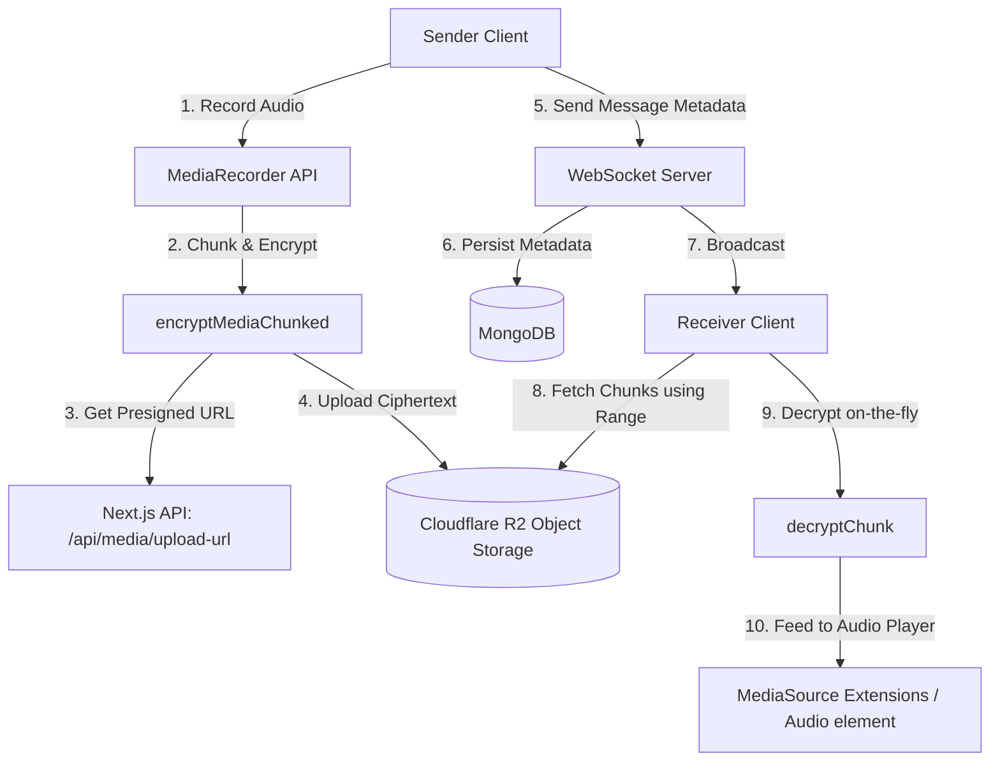

# Design Plan: E2EE Voice Messages with Progressive Streaming

This document outlines the architecture, database schema, encryption, and streaming design to introduce end-to-end encrypted (E2EE) Voice Messages in DeChat. It leverages the existing object storage architecture (Cloudflare R2), MongoDB database metadata storage, and chunked AES-256-GCM encryption with per-chunk initialization vectors (IVs) to support progressive audio streaming via HTTP range requests.

---

## 1. Architectural Overview

The system architecture for voice messages mimics the progressive video streaming subsystem, ensuring that large audio recordings are streamed incrementally without needing to download the entire audio file beforehand.



---

## 2. Encryption Architecture (Per-Chunk IV Mode)

To allow progressive playback of an encrypted voice message, the entire audio file is encrypted in chunks of a fixed size (e.g., **512 KiB** or **1 MiB**), matching the mechanism implemented for videos in `media-crypto.ts`.

### 2.1 Encryption Scheme (AES-256-GCM)
- For each chunk index `i` (0-indexed), a unique, cryptographically secure 12-byte initialization vector $\text{IV}_i$ is generated.
- Each chunk is encrypted independently using `AES-256-GCM` with the room's symmetric key and its specific $\text{IV}_i$, producing:
  $$\text{Ciphertext}_i = \text{Encrypted\_Chunk}_i + \text{16-byte GCM Auth Tag}$$
- All encrypted chunks are concatenated to form the final upload payload.
- All the generated chunk IVs are stored in a base64-encoded array (`chunkIvMap`) to be sent as part of the message metadata. This avoids real-time IV derivation calculations.

### 2.2 Metadata Schema
The message content in MongoDB stores the encrypted payload representation of the `AudioMetadata` object:
```typescript
interface AudioMetadata {
  type: "audio";
  objectKey: string;     // Unique identifier in R2
  mimeType: string;      // e.g. "audio/webm" or "audio/aac"
  size: number;          // Total size of plaintext audio in bytes
  duration: number;      // Duration in seconds
  iv: string;            // base64-encoded IV of the first chunk
  chunkSize: number;     // Plaintext chunk size (e.g., 524288 bytes)
  chunkIvMap: string[];  // Array of base64-encoded IVs for each chunk
}
```

---

## 3. Database Metadata & Schema Changes

### 3.1 MongoDB validation
We must update the `messageType` validation checks to permit `"audio"`:
- **`packages/websocket-server/src/db.ts`**: Update the `messageType` union types inside `PersistEncryptedMessageInput` and `ReplyToSubdocument` to include `"audio"`.
- **`packages/frontend/src/lib/socket-client.ts`** and other models: Extend the TypeScript type definitions:
  ```typescript
  messageType: "text" | "image" | "video" | "gif" | "audio";
  ```

### 3.2 Offline Storage (IndexedDB / Outbox)
Update outbox database storage to serialize the pending voice message record:
- **`packages/frontend/src/lib/outbox-db.ts`**: Allow `"audio"` type for pending outgoing messages.
- Outbox reconciler (`packages/frontend/src/lib/outbox-reconcile.ts`) needs to serialize and reconcile outgoing voice messages.

---

## 4. Quoted Messages & Instant Navigation Resolution

### 4.1 Quoted Message Rendering
When an audio message is quoted/replied to, the quote preview must display a microphone emoji and the word "Audio" (similar to how image, video, and gif are formatted).
- **Update `packages/frontend/src/lib/quoted-message.ts`**:
  - In `encryptMessagePreview`, add `"audio"` message type support.
  - In `decryptReplyPreview`, add `"audio"` key mappings:
    ```typescript
    const label: Record<string, string> = {
      image: "📷 Image",
      video: "🎬 Video",
      gif: "📹 GIF",
      audio: "🎤 Audio",
    };
    ```
- **Update database & types schema**:
  - Ensure the WebSocket server's `ReplyToSubdocument` and all client models support `"audio"` under `messageType`.

### 4.2 Instant Jump Resolution (Caching Check)
To avoid unnecessary network roundtrips and loading overlays when jumping to a quoted message, we will optimize `handleQuoteClick` in [`packages/frontend/src/app/rooms/[roomId]/page.tsx`](file:///c:/Users/REYANSH/OneDrive/Desktop/DeChat/packages/frontend/src/app/rooms/[roomId]/page.tsx):
- **Local Cache Check**: Before setting `quoteLoading(true)` or calling the API, check if the `messageId` exists in the local `messages` list.
- **Instant Behavior**: If found locally:
  - Scroll directly to the message element.
  - Set the temporary highlight target (`setJumpTargetId(messageId)`).
  - Clear highlight target after 3 seconds.
- **Fallback behavior**: If not found in the local cache, enable the loading overlay, invoke `fetchMessagesAround(roomId, messageId, 25)`, batch update the local state with the returned context, and then scroll and highlight.


---

## 5. API & Object Storage Configuration

### 5.1 Upload Endpoint `/api/media/upload-url`
- Update [`packages/frontend/src/app/api/media/upload-url/route.ts`](file:///c:/Users/REYANSH/OneDrive/Desktop/DeChat/packages/frontend/src/app/api/media/upload-url/route.ts):
  - Add `MAX_AUDIO_SIZE = 15 * 1024 * 1024` (15 MB, sufficient for over 30 minutes of high-quality compressed audio).
  - Permit `audio/` mime types:
    ```typescript
    const isAudio = mimeType.startsWith("audio/");
    if (!isImage && !isVideo && !isAudio) {
      return NextResponse.json(
        { error: "Unsupported media type. Only images, videos, and audio are allowed." },
        { status: 400 }
      );
    }
    ```

### 5.2 HTTP Range Requests
- Since Cloudflare R2 is compatible with the S3 API, it natively supports **HTTP Range requests** (`Range: bytes=start-end`).
- The client-side range fetching engine (`fetchMediaRange` in [`media-storage.ts`](file:///c:/Users/REYANSH/OneDrive/Desktop/DeChat/packages/frontend/src/lib/media-storage.ts)) will fetch byte boundaries aligning with encrypted chunk boundaries (`chunkSize + 16`).

---

## 6. Frontend Streaming and Playback (progressive streaming)

To stream the decrypted voice messages progressively, we will build a `useProgressiveAudio` hook modeled after `useProgressiveVideo`.

### 6.1 Playback Hook
Using MediaSource Extensions (MSE) to append decrypted audio chunks on-the-fly:
```typescript
function useProgressiveAudio(
  objectKey: string,
  roomKey: CryptoKey,
  chunkIvMap: string[],
  chunkSize: number,
  mimeType: string
) {
  // Similar flow to useProgressiveVideo:
  // 1. HEAD request via range-0 to probe total size
  // 2. Instantiate MediaSource, attach it to a generated Blob URL
  // 3. Upon 'sourceopen' event, initialize SourceBuffer with the audio mimeType
  // 4. Fetch encrypted chunk range, retrieve the corresponding chunk IV from chunkIvMap, decrypt with decryptChunk, append to SourceBuffer
}
```
*Note: If a browser doesn't support MediaSource for specific audio codecs (e.g. some versions of Safari/iOS), we will fall back to downloading and decrypting the full audio blob in memory.*

### 6.2 Audio Player UX Component
A custom audio player component (`AudioMessage`) will be added to represent the voice messages:
- Displays recording duration, current playback timeline, play/pause controls.
- Displays an interactive waveform (using SVG/canvas derived from recording or simulated wave heights).
- Integrates premium styles matching the glassmorphism theme of DeChat (smooth transitions, hover indicators).

---

## 7. Voice Recording Flow & UI

### 7.1 Recording Mechanism
1. **Permission**: Request microphone access via `navigator.mediaDevices.getUserMedia({ audio: true })`.
2. **Recording**: Use the browser's `MediaRecorder` API to capture audio blocks using a high-efficiency codec (e.g., `audio/webm;codecs=opus` or `audio/mp4` depending on platform support).
3. **Visualization**: Provide a live visualizer (using the Web Audio `AnalyserNode`) showing active wave input feedback.
4. **Finalization**:
   - Stop recording and grab the resulting `Blob`.
   - Read as an `ArrayBuffer`.
   - Encrypt the buffer using `encryptMediaChunked(buffer, roomKey, 512 * 1024)` (512 KiB chunks) which generates the `chunkIvMap`.
   - Get the presigned URL, upload, and dispatch the metadata payload (including the `chunkIvMap`) over WebSockets.

---

## 8. Verification Plan

### 8.1 Automated Verification
- Unit test coverage for:
  - Verification of chunk extraction offsets and matching IV mapping from `chunkIvMap`.
  - Verification of MIME type and file size validations in `/api/media/upload-url`.
  
### 8.2 Manual Verification
- **Recording Test**: Confirm that microphone permissions are successfully handled, audio is recorded, compressed, and encrypted.
- **Network / Range Check**: Verify that when playing a recorded voice message:
  - Check browser DevTools -> Network tab to ensure HTTP `206 Partial Content` requests are triggered.
  - Validate that the chunk decrypter decrypts each chunk using its mapped IV from the metadata and successfully plays the stream sequentially.
- **Cross-Platform Test**: Test playback compatibility across multiple browser engines (Blink, WebKit/Safari, Gecko/Firefox).
