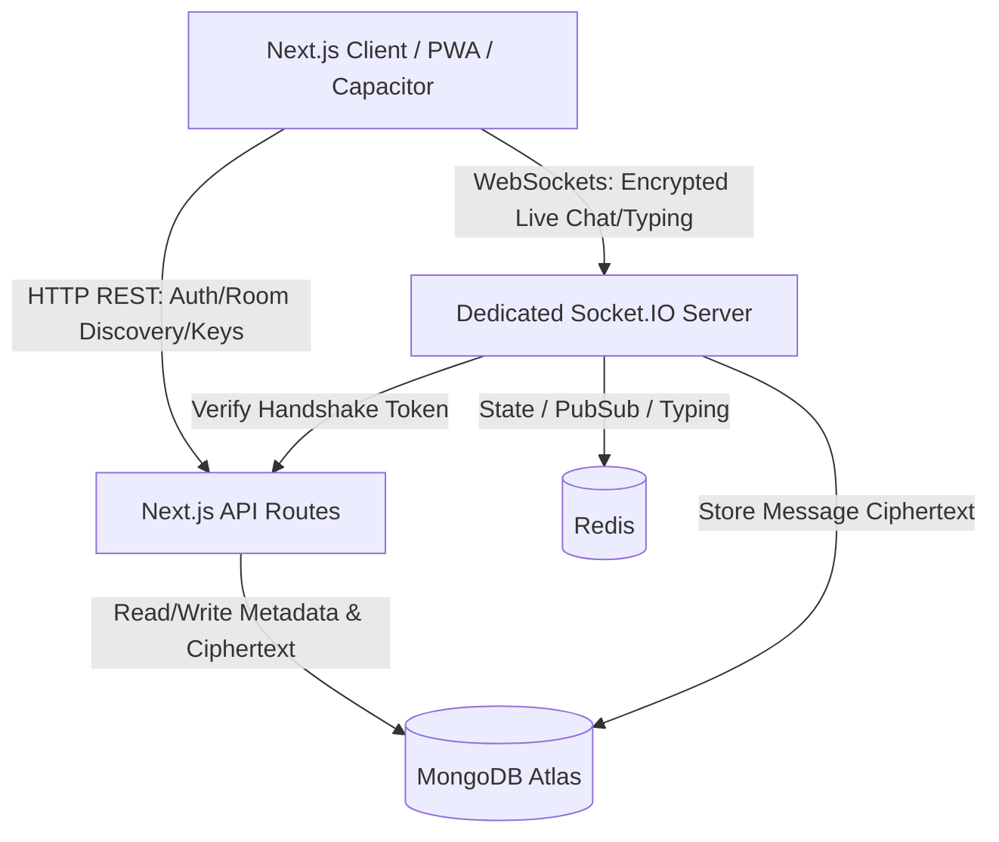
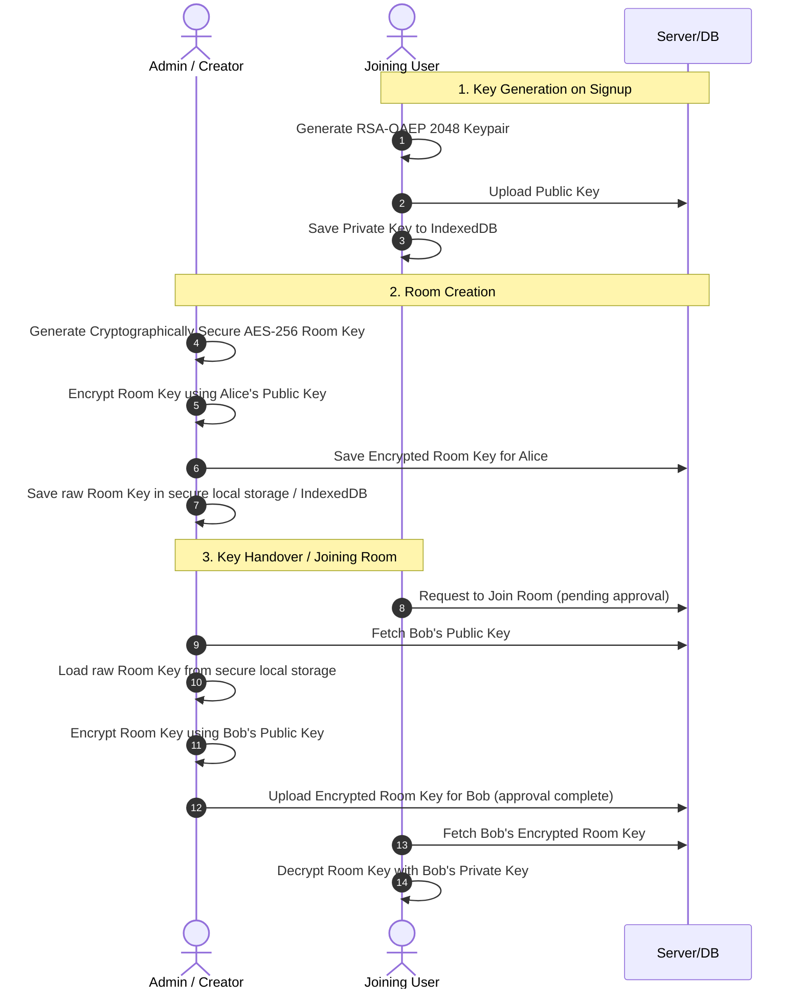
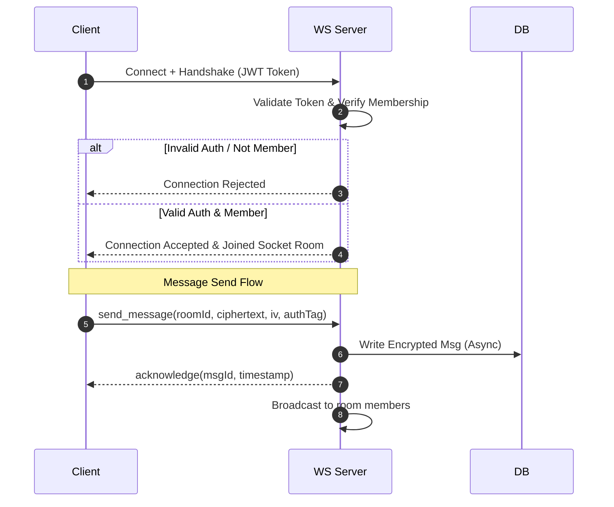

# Dechat Complete Revamp & Production Migration Plan

Dechat is being transformed from a hobby/experimental anonymous chatting application into a secure, privacy-first, end-to-end encrypted (E2EE), production-grade pseudonymous community messaging platform.

## Current Architecture & Technical Debt Analysis

1. **Monolithic & Coupled Backend**: 
   - `index.js` contains Express APIs, mongoose connection, Socket.IO event handlers, and in-memory room/color states all in one file.
   - In-memory objects (`rooms`, `colorPool`, `assignedColors`, `msg_index`, `isBubble`, `isReplying`) will lose state if the Node server restarts or horizontal scaling is attempted.
2. **Lack of Proper System Boundaries**:
   - WebSockets are used for room listing, join validation, state synchronization, and file chunks transfer.
   - Files are uploaded chunk-by-chunk through WebSockets in-memory (`imageChunks = []`), which consumes socket buffers and memory.
3. **No Database Persistence for Messages**:
   - Messages are broadcast to connected clients but are not stored in any database. Disconnected clients or clients joining later cannot see message history.
4. **Security Vulnerabilities**:
   - The backend stores plaintext user credentials (using simple password checks or incomplete flows).
   - Messages, files, and room configurations are sent in plaintext over WebSockets and the server has full visibility into user conversations.
   - Lack of authentication in WebSocket connections allows potential socket hijacking or spoofed events.

---

## Architectural Decisions & System Boundaries

To achieve a production-grade, highly scalable system, we establish clean boundaries:



### Component Breakdown
1. **Next.js API Runtime**: Handles stateless HTTP operations, including authentication (Better Auth), user profile management, room listing, room creation/discovery, room membership configurations, and metadata queries.
2. **Dedicated WebSocket Server**: Running on a separate runtime (e.g., Node.js / TypeScript on Railway/Render). It does not hold heavy business logic or HTTP endpoints. It is solely responsible for connections, client-to-room message routing, typing indicators, and message acknowledgements.
3. **Redis**: Manages ephemeral shared state (active socket-to-user maps, typing indicators) and coordinate events across instances using Redis Pub/Sub when scaling horizontally.
4. **MongoDB Atlas**: Serves as the system of record for persistence of user accounts, room discovery metadata, room memberships, encrypted room keys, and message ciphertexts (along with IV and authentication tags).

---

## Validation & Abuse Prevention Architecture

Validations are divided by layer to ensure efficiency and resilience:

### API-side Validation (HTTP)
- **Room Join/Create**: Validate input payloads (max capacity $\le 20$, room name length, visibility, description) using schemas (Zod). Check if the user is currently blocked or has `kickoutCount >= 3`.
- **Membership Management**: Enforce boundaries for Room Admins and regular members. Ensure a user can only query keys for rooms they belong to.

### WebSocket-side Validation
- **Authentication**: Sockets require a valid JWT/Session token during connection handshake. Anonymous socket connections are rejected.
- **Message Constraints**:
  - Max ciphertext payload size checks.
  - Reject messages where the corresponding database verification shows length > 500 characters on plaintext (enforced client-side before encryption, verified with maximum ciphertext length bounds on the socket server).
  - Rate limiting (e.g., token bucket algorithm) per socket connection to prevent DDoS or flooding.
  - Membership checks: Verify the sender is an active room member in Redis or MongoDB before broadcasting the message.

---

## Encryption Architecture (MVP)

The application guarantees that the backend database and WebSocket servers never access plaintext messages or keys.



### Key Technical Details
- **Browser-Side Key Generation**: Utilize the Web Cryptography API (`crypto.subtle`) to generate a client keypair (e.g., RSA-OAEP 2048-bit keys for key wrapping) and symmetric keys (AES-GCM 256-bit keys for room messaging).
- **Private Key Storage**: Store the user's private key client-side inside a secure **IndexedDB** instance. The private key must not be extractable (`extractable: false` flags in Web Crypto when generated, or wrapped with a client-derived master password key using PBKDF2 to ensure maximum local protection). It is never sent to the network.
- **Admin Room Key Storage**: The room creator/admin stores the raw room AES key in their secure client-side storage (e.g., IndexedDB). When a user joins or request is approved, the admin's client fetches the joining user's public key, encrypts the room key using it, and uploads the resulting `encryptedRoomKey` to the database.
- **AES-256-GCM Protocol**: Every message uses a unique, cryptographically secure random 12-byte Initialization Vector (IV). The encryption process yields the ciphertext and a 16-byte authentication tag.
- **Room Key Lifecycle & Reconnection**: Upon room entry, the client retrieves its encrypted room key, decrypts it using its local private key, and holds the raw AES key in secure client-side memory (React state/context). On page reload, the client pulls the key from local IndexedDB or re-fetches the encrypted key from the server.
- **Encrypted History Loading**: When loading room messages, the client fetches the ciphertexts, IVs, and tags from MongoDB via HTTP. Decryption occurs strictly client-side.

---

## Database Schema & Index Optimization

### Collections

#### 1. `users`
```typescript
interface User {
  _id: ObjectId;
  email: string;
  username: string;
  passwordHash: string; // Used by fallback or Better Auth credentials provider
  pfp?: string;
  publicKey: string; // JWK format or PEM representation of RSA public key
  createdAt: Date;
}
```
**Indexes**:
- `{ email: 1 }` (Unique)
- `{ username: 1 }` (Unique)

#### 2. `rooms`
```typescript
interface Room {
  _id: ObjectId;
  name: string;
  description?: string;
  creatorId: ObjectId;
  tags: string[];
  visibility: 'public' | 'private';
  capacity: number; // max 20
  roomLink: string; // unique invite link code
  isActive: boolean;
  createdAt: Date;
}
```
**Indexes**:
- `{ roomLink: 1 }` (Unique)
- `{ visibility: 1, tags: 1, createdAt: -1 }` (For public room discovery)

#### 3. `room_memberships`
```typescript
interface RoomMembership {
  _id: ObjectId;
  userId: ObjectId;
  roomId: ObjectId;
  joinedAt: Date;
  leftAt?: Date;
  lastVisitedAt: Date;
  encryptedRoomKey: string; // The Room AES Key encrypted with this member's Public Key
  role: 'admin' | 'member';
  isBlocked: boolean;
  kickoutCount: number;
  createdAt: Date;
  updatedAt: Date;
}
```
**Indexes**:
- `{ roomId: 1, userId: 1 }` (Unique compound index)
- `{ userId: 1, isBlocked: 1 }` (For checking user's room list and block statuses)

#### 4. `room_messages`
```typescript
interface RoomMessage {
  _id: ObjectId;
  roomId: ObjectId;
  senderId: ObjectId;
  ciphertext: string; // AES-256-GCM encrypted payload
  iv: string; // Initialization Vector (base64)
  authTag: string; // Verification Tag (base64)
  messageType: 'text' | 'image' | 'file';
  createdAt: Date;
}
```
**Indexes**:
- `{ roomId: 1, createdAt: -1 }` (For paginated history loading)

### Pagination Strategy
We will use **cursor-based pagination** (using `createdAt` and `_id` bounds) instead of offset-based pagination (`skip`) for message history to ensure optimal MongoDB index usage and prevent message duplication or skipping when new messages arrive dynamically.

---

## Room Discovery Architecture (HTTP vs WebSockets)

Room listing, filtering, search, and page navigation are served via **REST HTTP APIs** rather than WebSockets.

### Why HTTP is Preferred here
- **Caching & CDN Edge Delivery**: Public room search queries can be cached at edge routers or client-side HTTP cache (Stale-While-Revalidate).
- **Search Engine Optimization**: Public rooms can be pre-rendered or indexed for crawlers.
- **Resource Management**: It is highly inefficient to keep persistent stateful websocket pipes open merely to browse/search public rooms. Sockets should only be opened when the user enters a specific chat.
- **Indexing Strategy**: MongoDB text index on `name` and `tags` will support room discovery.

---

## WebSocket Architecture & Connection Lifecycle



### Critical WebSocket Operations
1. **Connection & Authorization Handshake**: Connections are authenticated by transmitting a short-lived handshake ticket or verifying the HTTP cookie/JWT.
2. **Reconnect & Sequence Numbers**: Clients track the last received message index/timestamp. When reconnecting, they send a `sync_since` packet to catch up on missed messages.
3. **Heartbeat (Ping-Pong)**: Socket.io uses dynamic heartbeat pings to detect half-open sockets promptly and release locked server resources.
4. **Message Acknowledgements**: Every message sent by a client awaits an explicit acknowledgement response (`ack`) from the server. If an `ack` is not received within a timeout (e.g., 5 seconds), the client displays a connection/retry warning state and queue-retries.

---

## Caching Architecture

| Resource / State | Store Location | Eviction/TTL Strategy | Rationale |
| :--- | :--- | :--- | :--- |
| **User Profiles / Public Keys** | Redis Cache + MongoDB | 24 Hours TTL / Write-through | Public keys are frequently queried but rarely change. |
| **Typing Indicators** | WebSocket Memory / Redis | Broadcast-based (TTL fallback) | Ephemeral state. Typing indicators are broadcast instantly and cleared on `stoppedTyping`. A fallback TTL (e.g., 3s) is used in Redis/memory to auto-expire the state if a user abruptly disconnects without emitting `stoppedTyping`. |
| **Active Room Count / Socket Maps** | Redis Hash | Removed on disconnect / 30-min heartbeat TTL | Needed for session routing and preventing duplicate connections. |
| **Encrypted Messages** | MongoDB (Strictly) | No Caching / Direct DB Queries | High write volume, client decrypts locally. Cached messages are not useful at the server-side as they are encrypted. |

---

## Phased Revamp Roadmap

### Phase 1: Project Restructuring & Monorepo Configuration
- Restructure project into a modular workspace/monorepo structure.
- Configure `frontend` (Next.js, Tailwind, TypeScript) and `websocket-server` (dedicated Node/TypeScript package).

### Phase 2: Authentication & User Accounts (Better Auth)
- Integrate Better Auth.
- Implement signup and login endpoints. Include client-side RSA keypair generation and public key registration during signup.

### Phase 3: MongoDB Schema Setup & Room Metadata APIs
- Define Mongoose/MongoDB connection and write schemas.
- Implement room creation, discovery search (HTTP), and join configurations.

### Phase 4: Room Memberships & E2EE Key Exchange
- Build backend APIs to manage room memberships.
- Implement the client-side AES room key wrapping/unwrapping protocol. Allow admins to securely exchange wrapped room keys to new members.

### Phase 5: WebSocket Server Setup & Authentication Handshake
- Create the standalone Socket.IO server.
- Bind connection handshakes to user auth tokens.

### Phase 6: Realtime E2EE Messages & Persistence
- Connect client UI to WebSocket messages.
- Implement background encryption/decryption, database persistence of ciphertext, and typing indicators.

---

## Remaining Phases (Community Rooms, Membership Management & UX)

The phases below cover the remaining work for the “community rooms” evolution: persistent membership, scalable capacity, atomic join requests, disabled/read-only rooms, multi-admin support, pseudonymous identity display (`username #index`), room-scoped presence, improved navigation, and caching.

### Phase 7: Room Model Upgrade (Community Room Fields)
- **Room schema**: add/standardize `rooms.joinPolicy` (`PUBLIC | APPROVAL_REQUIRED | PRIVATE`), `rooms.maxMembers` (default `500`), `rooms.memberCount` (counter), `rooms.nextUserIndex` (counter), `rooms.isDisabled`.
- **Membership schema**: standardize uppercase `status` (`PENDING | APPROVED | REJECTED | LEFT`); add `reviewedBy`, `reviewedAt`, `userIndex`, `isOnline`; promote multi-admin via `role` (`OWNER | ADMIN | MEMBER`).
- **Indexes** (idempotent): ensure unique membership (`roomId+userId`), room discovery (`joinPolicy/isDisabled/isActive`), message pagination (`roomId+createdAt+_id`), presence (`roomId+isOnline`).
- Ensure room creation initializes: `{ maxMembers: 500, memberCount: 1, nextUserIndex: 2, isDisabled: false }` and creator membership uses `role=OWNER`, `userIndex=1`.

### Phase 8: Join Flow Rework (No “Waiting for Approval” WebSocket)
- **Public**: join creates `APPROVED` membership immediately.
- **Approval required**: join creates `PENDING` membership; user continues browsing; request is tracked in Pending Requests view.
- **Private**: never appears in Discover/Search; join only via invite link; membership can be created as `APPROVED` (subject to capacity/disabled checks).
- Update Discover UI to display **Join** vs **Request access** based on `joinPolicy`.
- Remove in-room “approval waiting” state entirely (room page must not keep sockets alive waiting for admin action).

### Phase 9: Atomic Join Request Review + Capacity Race Handling
- Implement join request review to be **atomic**:
  - Only the first admin review wins; second must safely return `409` (“already reviewed”).
  - Write `reviewedBy` and `reviewedAt` exactly once.
- **Room-full edge case** (e.g., memberCount=499, maxMembers=500, two approvals at once):
  - Only one approval increments `rooms.memberCount` to 500.
  - Second approval auto-transitions the request to `REJECTED` and returns a subtle user-facing message: “This room has reached its member limit.”
- Prefer Mongo transactions / conditional updates for the `memberCount` reservation.

### Phase 10: Disabled Room Lifecycle (Read-only Rooms)
- Add owner-only ability to set `rooms.isDisabled=true`.
- When disabled:
  - room disappears from Discover/Search,
  - no new join requests,
  - all pending requests deleted,
  - no new messages/typing/events accepted server-side.
- Existing members can still open room and read message history and members list.
- UI: subtle banner “This room has been disabled by its owner.” and disable chat input/typing.

### Phase 11: Room-Scoped Presence (`isOnline`) + Member List Improvements
- On `join_room` websocket: set `room_memberships.isOnline=true`.
- On `leave_room` and disconnect: set `isOnline=false`.
- UI member list:
  - show “Online” and “Offline” sections,
  - include `username #userIndex` everywhere member identity is displayed,
  - implement **debounced** member search by username (and support matching `username#index` display).
- Note: document a future Redis-based presence layer as a scalable alternative (Mongo presence is acceptable for v1).

### Phase 12: Message UI Identity Improvements (`username #index`)
- Update message list to display `username #index` above each bubble (WhatsApp-style group UX), not internal IDs.
- Ensure styling remains subtle and consistent with the existing theme.

### Phase 13: Navigation Restructure (Minimal UI Extension)
- Add clear separation:
  - Discover
  - Joined Rooms
  - Pending Requests
  - My Rooms
  - Profile
- Desktop: header nav; Mobile: footer nav (avoid full redesign).
- My Rooms: owner dashboard for room settings (disable + maxMembers).

### Phase 14: Client Caching & Sync (IndexedDB + Cursor Pagination)
- Cache encrypted message history in **IndexedDB** (ciphertext/iv/authTag only; server remains blind).
- Add a sync anchor mechanism (`lastReadMessageId` or equivalent) to fetch only missing messages on rejoin.
- Pagination rules:
  - newest messages load first,
  - fetch older messages on upward scroll,
  - cursor-based pagination only (no offsets).
- Define invalidation strategy (membership left/rejected, room disabled, etc.).

### Phase 15: WebSocket Lifecycle Finalization (Notifications + Disabled Enforcement)
- Websocket responsibilities:
  - realtime chat + typing (members only),
  - notify users of request updates (`REQUEST_APPROVED` / `REQUEST_REJECTED`) without keeping sockets “waiting”.
- Lifecycle coverage:
  - connect/auth ticket,
  - user subscription (`user:{userId}`),
  - room subscription (`room:{roomId}`),
  - leave, disconnect, reconnect,
  - message ACKs,
  - presence updates,
  - disabled-room handling (reject send/typing with clear codes/messages).

### Phase 7: History Loading, Reconnect Recovery, and Pagination
- Add paginated message history loading.
- Add socket reconnect catches to replay missed messages since the last received timestamp.

### Phase 8: Scaling Foundation (Redis Integration)
- Implement Redis adapter for Socket.IO horizontal scale-out.
- Transition session mapping and typing states to Redis.

---

## Verification Plan

### Automated Tests
- Integration tests using Jest/Supertest for API endpoints (room discovery, auth, key exchange).
- Client cryptography unit tests validating Web Cryptography keygen and AES-256-GCM encryption/decryption.
- WebSocket connection tests simulating multiple clients joining and sending messages.

### Manual Verification
- Testing user registration and verified key creation in client IndexedDB.
- Testing real-time communication between multiple local browser windows (verifying the DB only gets ciphertext).
- Testing reconnect state by simulating network drops and verifying automatic catch-up of messages.

## Open Questions & Review Required

> [!IMPORTANT]
> **1. Private Key Recovery Policy**: (Decided) We will support exporting an externally saved "recovery kit" (an encrypted version of the private key wrapped with a user-defined passphrase for secure download) or standard recovery phrase backup, allowing users to restore their keys if browser state is cleared.
> 
> **2. Initial Room Key Distribution**: (Decided) The Admin/Creator controls the handover of the encrypted room keys per user requesting to join initially. The Admin client stores the raw roomKey in secure local storage, fetches the joining user's public key upon approval, encrypts the roomKey, and sends it to the database for the joining user to collect.
